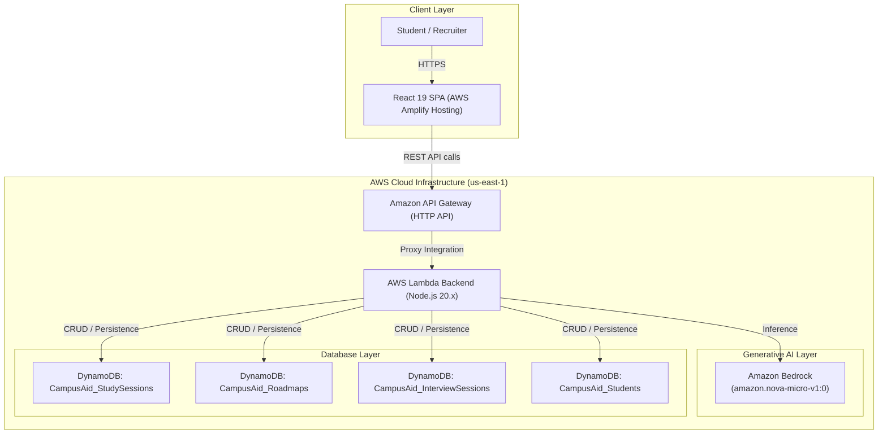

# 🎓 CampusAid AI — Next-Gen Academic & Career Copilot on AWS

> **Live Serverless Academic & Career Mentorship Platform powered by Amazon Bedrock, AWS Lambda, Amazon DynamoDB, and AWS Amplify.**

[](https://aws.amazon.com)
[](https://aws.amazon.com/bedrock)
[](https://aws.amazon.com/dynamodb)
[](https://aws.amazon.com/amplify)

---

## 🌟 Overview

**CampusAid AI** is a personalized AI mentor and career acceleration platform designed for college students and engineering undergraduates. It bridges academic learning and industry readiness through real-time AI tutoring, personalized career roadmap generation, ATS resume optimization, and interactive mock interview coaching.

---

## 🏛️ System Architecture

CampusAid AI is built natively on AWS using modern serverless cloud patterns:



---

## 🚀 Key AWS Services Used

| AWS Service | Role in CampusAid AI |
|---|---|
| **Amazon Bedrock** | Powers real-time academic tutoring, ATS resume keyword scoring, rubric-based interview evaluation, and multi-phase career roadmap generation using **Amazon Nova Micro** and **Anthropic Claude 3**. |
| **AWS Lambda** | Unified serverless API backend executing business logic, query sanitization, and orchestrating Bedrock & DynamoDB workflows with zero server management. |
| **Amazon DynamoDB** | High-throughput, low-latency NoSQL database storing student profiles, study sessions, career roadmaps, and interview transcripts. |
| **Amazon API Gateway** | Public HTTPS REST/HTTP gateway providing secure API routing, CORS preflight handling, and request throttling. |
| **AWS Amplify** | Continuous integration and global edge CDN hosting for the React single-page frontend. |

---

## ✨ Core Features

1. **📚 AI Study Assistant (Bedrock-Powered)**: Instant conceptual explanations, real-world code examples, and key takeaways for CS and engineering topics. Automatically persists sessions to DynamoDB.
2. **🗺️ Dynamic Career Roadmaps**: Generates custom 4-phase milestone learning paths tailored to student's academic year, branch, and target career goal.
3. **📄 ATS Resume Matcher & Optimizer**: Scores resumes against target role keywords and uses Bedrock to rewrite bullet points using the Google XYZ formula (*Accomplished X, measured by Y, by doing Z*).
4. **🎙️ Mock Technical Interview Coach**: Generates role-specific questions and evaluates candidate answers against a technical rubric (accuracy, completeness, clarity) with constructive model answers.
5. **💻 Sandboxed Code Playground**: Practice JavaScript algorithms in an isolated browser Web Worker environment detached from DOM and storage.
6. **🔒 Enhanced Security Posture**: Client passwords securely hashed with SHA-256 (`crypto.subtle`) with zero plaintext storage.

---

## 🛠️ Local Development & Setup

### Prerequisites
- Node.js (v18+)
- npm

### Installation
```bash
# Clone the repository
git clone https://github.com/sidwikbandaru/campusaid.git
cd CampusAid

# Install dependencies
npm install

# Start local development server
npm run dev
```

### Environment Configuration (`.env`)
```env
VITE_AWS_API_URL=https://2feoqqz7za.execute-api.us-east-1.amazonaws.com/default/CampusAid-API
```

---

## 🧪 Testing & Validation

```bash
# Run linter
npm run lint

# Build production bundle
npm run build
```

---

## 📄 License
MIT License. Built for the AWS Hackathon 2026.
